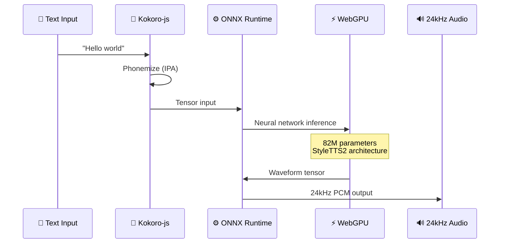

<p align="center">
  
  
  
  
</p>

<h1 align="center">🌙 NeuralWhisper</h1>

<p align="center">
  <strong>AI-Powered Whisper Synthesis</strong><br/>
  An 82 million parameter neural TTS model running 100% in your browser.<br/>
  No servers. No API calls. Just your GPU rendering soothing ASMR voices.
</p>

<p align="center">
  <a href="#-features">Features</a> •
  <a href="#-quick-start">Quick Start</a> •
  <a href="#-how-it-works">How It Works</a> •
  <a href="#-contributing">Contributing</a>
</p>

---

## 🧠 Why NeuralWhisper?

Traditional web TTS uses robotic voices or expensive API calls. NeuralWhisper downloads a **real neural network** to your browser and runs inference on your GPU. The result? Studio-quality ASMR voices with zero latency and complete privacy.

| Traditional TTS | NeuralWhisper |
|-----------------|---------------|
| ❌ Robotic voices | ✅ Neural 82M model |
| ❌ Server dependency | ✅ 100% client-side |
| ❌ API costs | ✅ Completely free |
| ❌ Privacy concerns | ✅ Your data stays local |

---

## ✨ Features

| Feature | Description |
|---------|-------------|
| 🧠 **Neural TTS** | Kokoro 82M model via ONNX Runtime WebGPU |
| 📄 **PDF Upload** | Drag-and-drop with intelligent text extraction |
| 🎤 **28+ Voices** | Male/female, US/UK accents, various styles |
| 🎚️ **ASMR Controls** | Pitch & speed for perfect whisper effect |
| 🌊 **GPU Waveform** | Real-time audio visualization |
| 🌙 **Premium UI** | Glassmorphism dark theme |

---

## 🚀 Quick Start

### Prerequisites
- Node.js 18+
- Modern browser with WebGPU support (Chrome 113+, Edge 113+)

### Development

```bash
# Clone the repository
git clone https://github.com/YOUR_USERNAME/neuralwhisper.git
cd neuralwhisper

# Install dependencies
cd frontend
npm install

# Start development server
npm run dev
```

Open [http://localhost:5173](http://localhost:5173)

> ⚠️ **First load downloads ~160MB model.** Subsequent loads use browser cache.

### Production Build

```bash
npm run build
npm run preview
```

### Docker

```bash
docker-compose up -d
# Access at http://localhost:3000
```

---

## 🔊 How It Works



Your browser:
1. **Downloads** the Kokoro-82M ONNX model (~160MB, cached)
2. **Initializes** ONNX Runtime with WebGPU backend
3. **Runs inference** on your GPU for each text chunk
4. **Outputs** 24kHz studio-quality audio

---

## 🎤 Available Voices

| Voice | Accent | Style |
|-------|--------|-------|
| ❤️ Heart | US Female | Warm, intimate |
| 🔥 Bella | US Female | Energetic |
| 👑 Emma | UK Female | Refined |
| 🐺 Fenrir | US Male | Deep |
| 🎩 George | UK Male | Formal |

[See all 28 voices →](https://huggingface.co/onnx-community/Kokoro-82M-v1.0-ONNX#samples)

---

## 📁 Project Structure

```
neuralwhisper/
├── frontend/
│   ├── src/
│   │   ├── App.jsx           # Main application
│   │   ├── lib/
│   │   │   ├── tts-gpu-engine.js  # WebGPU TTS
│   │   │   └── pdf-parser.js      # PDF extraction
│   │   └── index.css         # Glassmorphism styles
│   └── vite.config.js
├── scripts/                  # Voice processing tools
├── docs/                     # Architecture docs
└── docker-compose.yml
```

---

## 🌐 Browser Support

| Browser | Min Version | Notes |
|---------|-------------|-------|
| Chrome/Edge | 113+ | Full WebGPU support |
| Firefox | Nightly | `dom.webgpu.enabled` flag |
| Safari | 18+ | Tech Preview |

> Falls back to **WebAssembly** (CPU) if WebGPU unavailable.

---

## 🤝 Contributing

We welcome contributions! Please see our [Contributing Guide](CONTRIBUTING.md) and [Code of Conduct](CODE_OF_CONDUCT.md).

```bash
# Fork, clone, and create a branch
git checkout -b feature/amazing-feature

# Make your changes and test
npm run build

# Commit and push
git commit -m "feat: add amazing feature"
git push origin feature/amazing-feature
```

---

## 📜 License

MIT License - see [LICENSE](LICENSE) for details.

---

<p align="center">
  <strong>🌙 Neural whispers. ⚡ Your GPU. 🎧 Pure ASMR.</strong>
</p>

<p align="center">
  <sub>Built with ❤️ using Kokoro-82M, ONNX Runtime, React, and Vite</sub>
</p>
