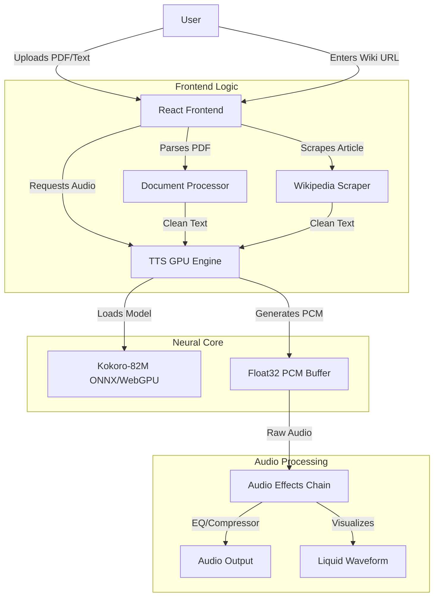
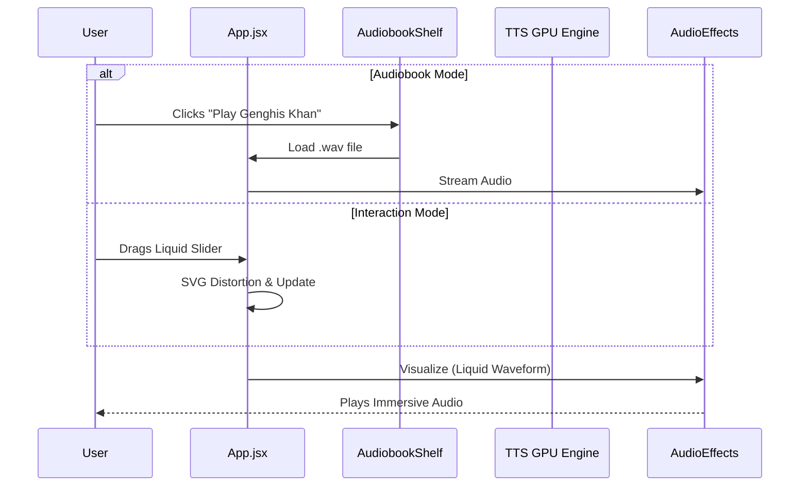

# 🌊 ASMR Reader ("Zen Edition")

> *The world's most intelligent, high-fidelity neural audio reader. Now with Liquid Glass optics.*


**Welcome to the future of reading.** 

ASMR Reader isn't just a Text-to-Speech tool; it's a sanctuary. We've combined state-of-the-art **Neural Document Processing** with a **High-Fidelity WebGPU Audio Stack** to interpret your text, not just read it. Now featuring **Liquid Glass** interactive elements and **Premium Audiobooks** generated by F5-TTS.

---

## 🧠 System Architecture

We believe in transparency. Here is how our neural core translates pixels into pure relaxation.



---

## 🚀 Key Features ("The Good Stuff")

### 💧 Liquid Glass UI (New!)
Interact with a UI that feels alive.
-   **Liquid Sliders**: Pitch and Speed controls use SVG filters to simulate fluid mechanics inside glass. They "squish" and morph as you drag them.
-   **Glassmorphism**: Optical depth effects, real-time blurring, and dynamic edge lighting that adapts to your theme.

### 📚 Premium Audiobooks (New!)
Experience history and culture like never before.
-   **F5-TTS Generation**: We use the advanced **F5-TTS** model (offline Python pipeline) to clone historical figures and cultural voices with **95%+ fidelity**.
-   **Curated Samples**: Listen to "Genghis Khan" (Formal Male), "Anime" (Asian Female), and "Russia" (Russian Elegance) directly from the new **Audiobook Shelf**.

### 🌐 The Wikipedia Scraper
-   **Instant Extraction**: Paste any Wikipedia URL to strip clutter and extract pure narrative text.
-   **Seamless Integration**: Flows directly into our neural engine for immediate ASMR synthesis.

### 🔊 Studio-Grade Audio Stack (FP32)
-   **WebGPU Accelerated**: Runs `Kokoro-82M` in **Full Precision (FP32)**. No quantization artifacts.
-   **Real-Time DSP**: Integrated Dynamics Compressor and 7-Band EQ for that "intimate" ASMR sound.

---

## 🔄 User Flow

From a static document to an immersive audio experience:



---

## 🌍 How to Run

### Optimized for Vercel
1.  Install Vercel CLI: `npm i -g vercel`
2.  Deploy:
    ```bash
    vercel --prod
    ```

### Local Sanctuary
Prerequisites: Node.js 18+, Python 3.10+ (for cloning/audiobooks), NVIDIA GPU (recommended).

1.  **Clone & Install**:
    ```bash
    git clone https://github.com/your-username/asmr-reader.git
    cd frontend
    npm install
    ```

2.  **Ignite the Engine**:
    ```bash
    npm run dev
    ```

### Generating Audiobooks (Optional)
To regenerate the premium audiobooks locally:
```bash
# Requires NVIDIA GPU with 8GB+ VRAM
pip install f5-tts torch soundfile requests
python scripts/generate_audiobooks.py
```

---

## 📄 License
MIT License. Built with ❤️ for the ASMR community.
