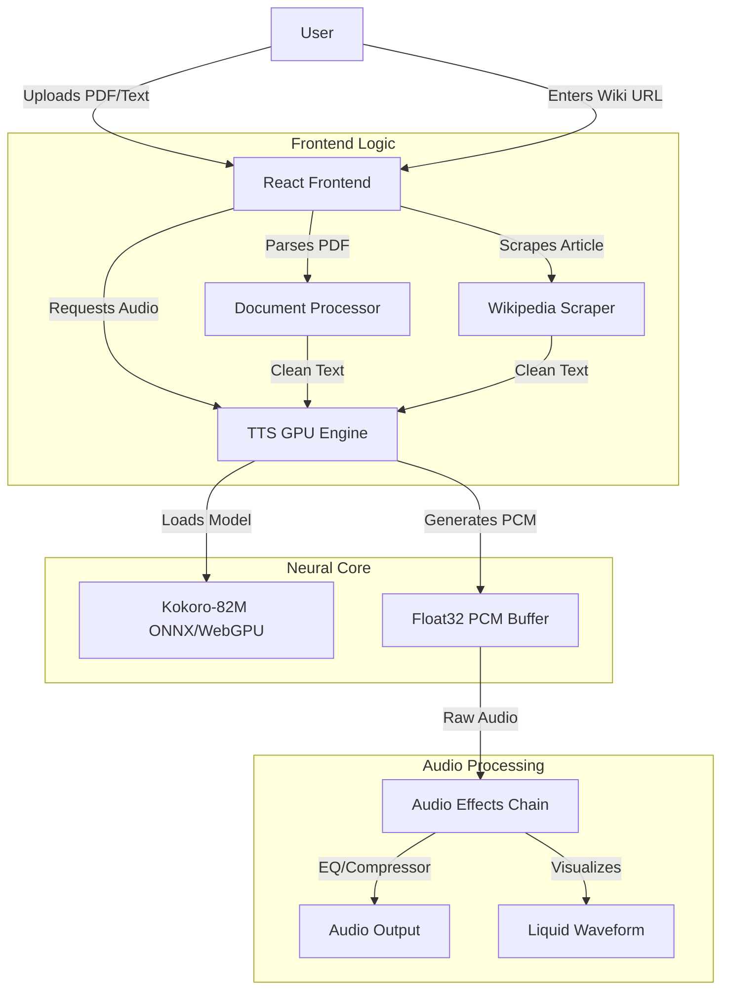
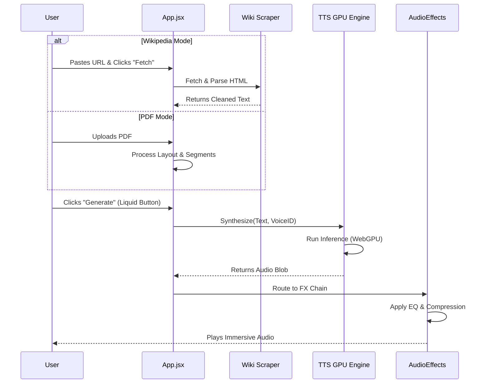

# 🌊 ASMR Reader ("Zen Edition")

> *The world's most intelligent, high-fidelity neural audio reader. Now with Liquid Glass optics.*


**Welcome to the future of reading.** 

ASMR Reader isn't just a Text-to-Speech tool; it's a sanctuary. We've combined state-of-the-art **Neural Document Processing** with a **High-Fidelity WebGPU Audio Stack** to interpret your text, not just read it. Whether you're digesting a dense PDF or unwinding with a Wikipedia deep-dive, our AI breathes life into every syllable.

---

## 🧠 System Architecture

We believe in transparency. Here is how our neural core translates pixels into pure relaxation.



---

## 🚀 Key Features ("The Good Stuff")

### 🌐 The Wikipedia Scraper (New!)
Ever wanted to fall asleep to the history of the *Roman Empire* or the physics of *Black Holes*?
-   **Instant Extraction**: Paste any Wikipedia URL, and our scraper surgically removes the clutter (citations, sidebars, "edit" buttons) to leave only the pure narrative text.
-   **Seamless Integration**: The extracted text flows directly into our neural engine, ready for immediate ASMR synthesis.

### 🧠 Neural Document Intelligence
Stop listening to broken PDF text. Our **Neural Processor** understands layout and flow.
-   **Spatial Reconstruction**: Reads PDF `transform` matrices to reconstruct multi-column layouts perfectly.
-   **NLP Segmentation**: Uses natural language processing to detect "breath groups," inserting dynamic pauses where a human reader would naturally take a breath.

### 🔊 Studio-Grade Audio Stack (FP32)
We don't do "robotic." We do **Hyper-Realism**.
-   **WebGPU Accelerated**: Runs `Kokoro-82M` models directly on your GPU in **Full Precision (FP32)** mode. No quantization artifacts, just pure high-fidelity audio.
-   **Real-Time DSP**: Our integrated "Atmosphere" chain features:
    -   *Dynamics Compressor*: Smooths volume for that intimate ASMR feel.
    -   *7-Band EQ*: Professional presets for "Crisp," "Deep," and "Binaural" spatial modes.

### 🎨 "Zen" Atmosphere System & Liquid Glass
Your reading environment matters.
-   **Liquid Glass UI**: Experience our new interface style featuring optical depth, edge highlighting, and organic blur effects.
-   **Dynamic Glassmorphism**: The UI adapts to your background using real-time blur and color mixing.
-   **The Hive Mind**: The app **learns** from you. If you skip pauses or speed up specific voices, it remembers and adapts future playback automatically.

---

## 🔄 User Flow

From a static document to an immersive audio experience:



---

## 🌍 How to Run

### Optimized for Vercel
1.  Install Vercel CLI: `npm i -g vercel`
2.  Deploy:
    ```bash
    vercel --prod
    ```

### Local Sanctuary
Prerequisites: Node.js 18+, Python 3.10+ (for cloning), NVIDIA GPU (optional).

1.  **Clone & Install**:
    ```bash
    git clone https://github.com/your-username/asmr-reader.git
    cd frontend
    npm install
    ```

2.  **Ignite the Engine**:
    ```bash
    npm run dev
    ```

---

## 📄 License
MIT License. Built with ❤️ for the ASMR community.
