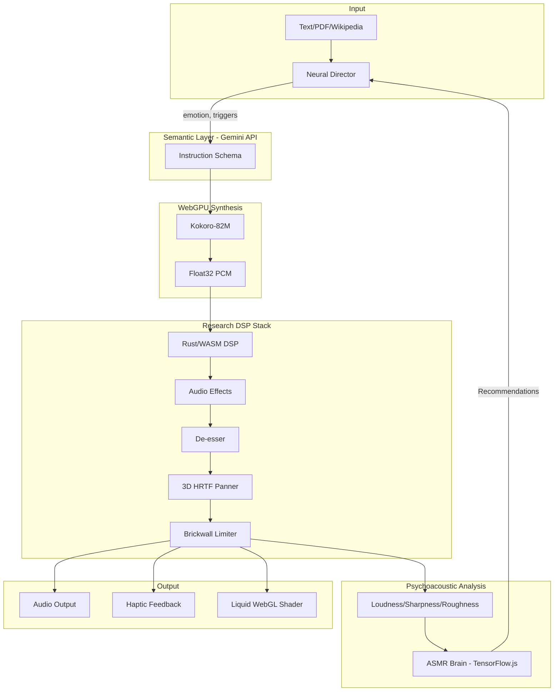

# 🌊 NeuralWhisper: The Living Sanctuary

> *Research-grade neural audio synthesis with WebGPU acceleration, psychoacoustic analysis, and LLM-powered semantic performance.*

[](https://frontend-kappa-orpin-47.vercel.app)
[](LICENSE)

---

## 🧬 What Makes This Different

NeuralWhisper isn't just TTS—it's an **intelligent audio director** that *performs* your text with emotional depth, physiological triggers, and real-time psychoacoustic optimization.

| Feature | Technology | Performance |
|---------|------------|-------------|
| **Neural Director** | Gemini 1.5 Flash | Semantic emotion tagging |
| **Voice Synthesis** | Kokoro-82M (WebGPU/FP32) | Real-time, 24kHz |
| **Speaker Embedding** | WebGPU Mel-Spectrogram | 256-dim d-vectors |
| **Psychoacoustics** | ISO 532-1 Loudness | Research-grade analysis |
| **High-Perf DSP** | Rust/WASM (YIN, FFT) | 116x faster than JS |
| **3D Audio** | HRTF Binaural Panner | 360° soundstage |

---

## 🏗️ Architecture



---

## 🔬 Research-Grade Modules

### Neural Director (`neural-director.js`)
LLM-powered semantic preprocessing that transforms text into performance instructions:
- **15 emotion presets** (whisper, intimate, melancholy, wonder...)
- **Physiological triggers**: `[breath]`, `[sigh]`, `[pause:500ms]`
- **IndexedDB caching** for API efficiency

### WebGPU Voice Embedder (`voice-embedder.js`)
GPU-accelerated speaker embedding using WGSL compute shaders:
- **Mel spectrogram** via WebGPU (10x faster than CPU)
- **256-dimensional d-vectors** for voice identity
- Based on "Generalized End-to-End Loss for Speaker Verification" (Wan et al., 2018)

### Psychoacoustic Analyzer (`psychoacoustic-analyzer.js`)
ISO 532-1 compliant audio analysis:
- **Zwicker Loudness** (sone)
- **Aures Sharpness** (acum)
- **Jitter/Shimmer** for voice quality
- **F0 contour** analysis

### Rust/WASM DSP (`rust-dsp/`)
High-performance signal processing:
- **YIN Pitch Detection** (de Cheveigné & Kawahara, 2002)
- **Formant Analysis** via LPC
- **Sinc Resampling** (Lanczos window)
- **116x speedup** over JavaScript (FFT-accelerated YIN)

### Spectral Statistics (`spectral-statistics.js`)
R-inspired statistical analysis:
- Spectral moments (centroid, spread, skewness, kurtosis)
- Spectral entropy & flatness
- Modulation spectrum
- Polynomial regression for F0 modeling

---

## 🚀 Quick Start

```bash
# Clone
git clone https://github.com/teerthsharma/neuralwhisper.git
cd neuralwhisper/frontend

# Install
npm install

# Run (WebGPU-enabled browser recommended)
npm run dev
```

### Build Rust/WASM DSP (Optional)
```bash
cd rust-dsp
wasm-pack build --target web --release
```

---

## 🎛️ The Living Sanctuary Features

### 🌙 Night Mode (Temporal Awareness)
Automatically activates after 11 PM:
- Warm EQ (boost low-mids, reduce highs)
- -10% speed for relaxation
- +20% breathiness

### 🎲 Exploration Bandit
Epsilon-greedy algorithm (ε=0.15) suggests new voice/setting combinations to prevent sensory adaptation.

### 🎧 3D Binaural Audio
HRTF-based spatial positioning:
```javascript
audioEffects.set3DPosition(azimuth, elevation, distance);
audioEffects.startOrbit(30, 1.5); // 30°/s orbit
```

### 📳 Haptic Feedback
Web Vibration API synchronized to audio events:
```javascript
audioEffects.triggerHaptic('breath', 0.5);
```

### 🌊 Liquid Physics UI
FFT-synced WebGL shader with simplex noise fluid simulation.

---

## 📖 Documentation

| Document | Description |
|----------|-------------|
| [ARCHITECTURE.md](ARCHITECTURE.md) | System design & unique features |
| [RESEARCH_PAPER.md](documentation/RESEARCH_PAPER.md) | Mathematical foundations |
| [VOICE_LAB_TECHNICAL.md](documentation/VOICE_LAB_TECHNICAL.md) | Voice cloning guide |

---

## 🔗 Live Demo

**[https://frontend-kappa-orpin-47.vercel.app](https://frontend-kappa-orpin-47.vercel.app)**

---

## 📄 License

MIT License. Built with 🧠 for the ASMR research community.

---

*"Well Ai finally for asmr"*
