# NeuralWhisper Architecture

## Overview

NeuralWhisper is a 100% client-side application that runs an 82 million parameter neural TTS model directly in your browser using GPU acceleration.

## System Architecture

```mermaid
graph TB
    subgraph Browser["🌐 Browser (100% Client-Side)"]
        PDF[PDF Upload] --> PDFJS[pdf.js Parser]
        PDFJS --> TEXT[Extracted Text]
        TEXT --> KOKORO[Kokoro TTS]
        KOKORO --> ONNX[ONNX Runtime]
        ONNX --> GPU[WebGPU Backend]
        GPU --> AUDIO[24kHz Audio]
        AUDIO --> VIZ[Waveform Viz]
    end
    
    subgraph Model["🤖 Kokoro-82M-ONNX"]
        direction LR
        HF[HuggingFace] --> CACHED[Browser Cache]
    end
    
    KOKORO -.->|Loads from| Model
```

## Key Components

### Frontend (`/frontend`)
| File | Purpose |
|------|---------|
| `App.jsx` | Main React application |
| `lib/tts-engine.js` | Web Speech API fallback |
| `lib/tts-gpu-engine.js` | Kokoro WebGPU TTS engine |
| `lib/pdf-parser.js` | pdf.js wrapper for text extraction |
| `lib/audio-effects.js` | ASMR audio effects pipeline |
| `lib/voice-profiles.js` | Voice configuration database |

### Voice Processing (`/scripts`)
Python scripts for offline voice sample processing using F5-TTS for custom voice embeddings.

## Data Flow

```mermaid
sequenceDiagram
    participant User as 📝 Text Input
    participant Kokoro as 🧠 Kokoro-js
    participant ONNX as ⚙️ ONNX Runtime
    participant GPU as ⚡ WebGPU
    participant Audio as 🔊 24kHz Audio
    
    User->>Kokoro: "Hello world"
    Kokoro->>Kokoro: Phonemize (IPA)
    Kokoro->>ONNX: Tensor input
    ONNX->>GPU: Neural network inference
    Note over GPU: 82M parameters<br/>StyleTTS2 architecture
    GPU->>ONNX: Waveform tensor
    ONNX->>Audio: 24kHz PCM output
```

## Technology Stack

- **Kokoro-js 1.2.1** — 82M parameter neural TTS
- **ONNX Runtime Web 1.23.2** — WebGPU/WASM inference
- **React 18.2** — UI framework
- **Vite 5.0** — Build tooling
- **pdf.js 4.0** — PDF parsing
